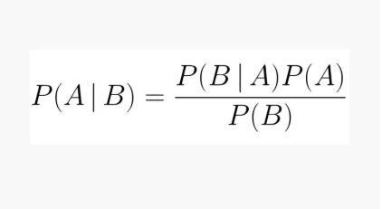
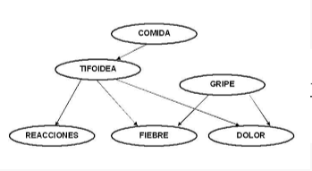

# Trabajo Práctico 2                                            

### Autores:
- **Cecio Octavio**
- **Chiappanni Valentino**
- **Crisnejo Matias**
- **Diani Julian**
- **Fiordalisi Agustin**
- **Llanez Alzogaray Juan Manuel**
- **Olson Miriam**
- **Robledo Javier** 
- **Robles Luciano** 

### Institución:
- **Universidad Nacional de Hurlingham**

### Materia:
- **Lógica y Programación**

### Docente:
- **Pablo Pandolfo**

### Tema:
- **Sistemas Expertos**

### Fecha:
- **23 de Junio de 2025**

# ¿Que es un Sistema Experto?
- **Un sistema experto es un programa de computadora que simula el comportamiento de un experto humano en un dominio específico. Su objetivo principal es resolver problemas complejos, tomar decisiones o dar recomendaciones tal como lo haría un especialista humano en ese campo.**

# Tipos de sistemas expertos

Los sistemas expertos se pueden clasificar según diferentes criterios. La clasificación más general suele dividirlos en tres tipos: sistemas basados en reglas, sistemas basados en casos (CBR) y sistemas basados en redes bayesianas. También suelen clasificarse según su composición interna, o sino, otra clasificación que suele estar presente por su área de aplicación, como diagnóstico, diseño, planificación, o control.

### Clasificación general 

* #### **Sistemas Basados en Reglas (Rule-Based Systems):**   Usan reglas de inferencia para brindar el conocimiento experto. Los sistemas basados en reglas funcionan aplicando una serie de instrucciones del tipo "si ocurre tal cosa, entonces hacer tal otra". Estas reglas permiten tomar decisiones en función de una situación determinada. El sistema analiza el estado actual, elige las reglas que se pueden aplicar, ejecuta alguna de ellas, y luego vuelve a evaluar la situación resultante para seguir actuando en consecuencia.

  Además, este tipo de sistemas puede razonar de dos maneras principales:  
  1. **Razonamiento hacia adelante (o progresivo):** el sistema parte de datos o hechos conocidos y aplica reglas de forma secuencial para llegar a una conclusión. Es decir, avanza desde lo que ya sabe hasta descubrir algo nuevo.  
  2. **Razonamiento hacia atrás (o regresivo):** en este caso, el sistema parte de una posible solución o hipótesis, y trata de verificar si hay hechos o reglas que la justifican. Es decir, retrocede desde la conclusión que quiere alcanzar para ver si puede demostrarla.

* **Razonamiento basado en casos:** almacenan información sobre casos previos y la usan para ofrecer soluciones a problemas similares previamente resueltos. Este tipo de enfoque se basa en la idea de que muchos problemas tienen patrones repetitivos, y que recordar cómo se resolvió un caso anterior puede ayudar a resolver uno nuevo de forma más rápida y eficiente.  
  El caso actual se suele guardar su solución ajustada por un próximo caso siguiente semejante.   
* **Basados en modelos:** Utiliza modelos para simular el comportamiento de sistemas físicos, tanto existentes como futuros, con el objetivo de comprender su funcionamiento y optimizar su diseño**.**   
* **Modelo bayesiano:** Se basa en el uso de un modelo estadístico bayesiano. El Teorema de Bayes, en grandes rasgos es una fórmula matemática que permite calcular la probabilidad de una hipótesis basada en la evidencia previa y la evidencia observada.  
  *Fórmula de bayes:*   
   

  En el contexto del aprendizaje automático (machine learning), un clasificador bayesiano es un modelo que utiliza la probabilidad para predecir a qué categoría pertenece un dato nuevo, basándose en la fórmula de Bayes.  
  Estos clasificadores aprenden a partir de datos ya etiquetados (conocidos como datos de entrenamiento), y luego aplican ese conocimiento para clasificar nuevos casos.  
  Un sistema experto usaría, la “**red bayesiana”** es decir un modelo gráfico que representa un conjunto de variables y las relaciones de dependencia probabilística entre ellas.  
    
  Una red bayesiana puede representar las relaciones probabilísticas entre enfermedades y síntomas. En el ejemplo anterior puede verse la fiebre y la gripe son síntomas de la fiebre tifoidea es una enfermedad infecciosa causada por la bacteria Salmonella Typhi, que se transmite principalmente por agua o alimentos contaminados.

### Clasificación según su estructura interna 

Los sistemas expertos también se clasifican **según la organización de sus componentes internos**, es decir, su arquitectura, y cómo estos se relacionan entre sí. 

* **Sistemas expertos monolíticos:** todas las partes del sistema, como su  base de conocimientos, motor de inferencia y módulo de interfaz están integradas en una sola unidad.  
* **Sistemas expertos modulares:** Un sistema experto modular está compuesto por distintos módulos independientes que se comunican entre sí, como la base de conocimientos, el motor de inferencia, la interfaz de usuario, y eventualmente módulos de aprendizaje o explicación. Esta estructura facilita el mantenimiento, la actualización de componentes por separado y la escalabilidad del sistema.

### Según su aplicación en un área específica

Cada sistema experto, como aplicación de Inteligencia Artificial, tiene un propósito para el cuál fue diseñado, es decir, tiene problemas que precisa resolver. Estos se clasifican de la siguiente manera:

* **Sistemas expertos de diagnóstico:** su función es identificar problemas y encontrar las causas que los provocan. Por ejemplo, un sistema que detecta fallas en una máquina o diagnostica enfermedades basándose en los síntomas.  
* **Sistemas expertos de diseño:** ayudan a crear soluciones o diseñar productos y sistemas, como diseñar un edificio, un circuito eléctrico o un plan de producción.  
* **Sistemas expertos de planificación:** se encargan de elaborar planes o estrategias para lograr objetivos concretos, como organizar una ruta de entrega o planificar las tareas de un proyecto.  
* **Sistemas expertos de control:** supervisan y regulan sistemas complejos en tiempo real. Por ejemplo, un sistema que controla la temperatura de una casa usando reglas simples como: “sí hace mucho calor, enciende el aire acondicionado”, o “si hace frío, prende la calefacción”.

### Según el grado de interacción con el usuario

Los sistemas expertos pueden funcionar de diferentes formas según cuánto y cómo interactúan con las personas que los usan. Por eso, se dividen en dos tipos principales:

* Sistemas expertos interactivos: en estos, el usuario y el sistema se comunican continuamente. El usuario puede hacer preguntas, recibir respuestas, recomendaciones y también explicaciones sobre cómo se llegó a una conclusión. Es un diálogo entre el sistema y la persona. Por ejemplo, un asesor virtual que te ayuda a elegir un producto y te explica por qué recomienda uno u otro.  
* Sistemas expertos de producción: estos sistemas trabajan solos, sin que el usuario tenga que intervenir durante su funcionamiento. Simplemente ejecutan sus tareas automáticamente. Por ejemplo, un sistema que controla una máquina industrial y ajusta sus parámetros sin necesidad de que alguien le diga qué hacer en cada momento.

# Ejemplos de Sistemas Expertos
- **MYCIN**
    - **Uno de los primeros sistemas expertos, desarrollado para diagnosticar enfermedades bacterianas y recomendar tratamientos con antibióticos.** [Más Información](https://msmk.university/mycin/)

- **Dendral**
    - **Diseñado para ayudar a los químicos a identificar estructuras moleculares.** [Más Información](https://es.wikipedia.org/wiki/Dendral)

- **Deep Blue**
    - **Un sistema experto que venció a Garri Kaspárov en una partida de ajedrez.** [Más Información](https://datascientest.com/es/deep-blue-todo-sobre)

- **XCon**
    - **Un sistema que automatiza la configuración de sistemas informáticos.** [Más Información](https://es.wikipedia.org/wiki/XCon)

- **Watson (IBM)**
    - **Una plataforma de inteligencia artificial que ha demostrado su capacidad en una variedad de aplicaciones, incluyendo atención médica y finanzas.** [Más Información](https://www.techtarget.com/searchenterpriseai/definition/IBM-Watson-supercomputer)

- **CaDet**
    - **Ayuda en el diagnóstico temprano del cáncer.** [Más Información](https://pubmed.ncbi.nlm.nih.gov/9892994/)

- **DXplain**
    - **Ayuda a los médicos a diagnosticar diversas enfermedades.** [Más Información](https://www.mghlcs.org/projects/dxplain)

- **Dipmeter Advisor**
    - **Analiza datos de exploración petrolera.** [Más Información](https://en.wikipedia.org/wiki/Dipmeter_Advisor)

- **CADUCEUS**
    - **Se especializa en diagnósticos de medicina interna.** [Más Información](https://es.wikipedia.org/wiki/CADUCEUS_(sistema_experto)

# ¿Que es Prolog y como funciona?
**Prolog es un lenguaje de programación declarativo basado en lógica de predicados. En lugar de indicar paso a paso cómo resolver un problema, se describe un conjunto de hechos y reglas, y se realizan consultas. El motor de Prolog intenta demostrar esas consultas utilizando unificación y backtracking.**

**Los hechos son afirmaciones simples que representan la base de conocimiento del sistema.**

- *padre(juan, pedro).*

**Las reglas, representan relaciones lógicas entre los hechos.**
 - *progenitor(X, Y) :- padre(X, Y).*
**Las consultas, realizadas por el usuario, se realizan en un apartado de la interfaz donde se formulan preguntas al sistema.** 
 - *?- progenitor(X, pedro).*

**El mecanismo utilizado por prolog para responder a las consultas es la unificación, el sistema compara términos e intenta hacerlos coincidir mediante sustitución de variables.**

 *“padre(juan, Y). El sistema reemplaza la variable Y unificando con el hecho padre(juan, pedro), dando como resultado Y = Pedro.”*

**Cuando una consulta puede satisfacerse de más de una forma, el sistema utiliza la técnica de backtracking, que le permite volver al punto de decisión anterior y probar otra opción, para de esa manera encontrar todas las soluciones posibles, o confirmar que ninguna lo satisface.**

# ¿Cuál es su motor de inferencia? Elección de implementar el sistema experto
**Prolog es ideal para implementar sistemas expertos porque ya incluye un motor de inferencia incorporado. Este motor permite razonar automáticamente sobre los hechos y reglas para llegar a conclusiones, tal como lo haría un experto humano.**

**El motor de inferencia de Prolog funciona buscando respuestas lógicas a partir de las reglas definidas. Utiliza un proceso llamado resolución lógica, que compara lo que se pregunta con lo que se sabe, y deduce nueva información si es necesario. Este enfoque es el corazón de los sistemas expertos.**

- **Se elige Prolog porque:**

    - **Permite representar el conocimiento de forma simple y estructurada.**

    - **Su motor de inferencia resuelve automáticamente los problemas sin necesidad de programar los pasos.**

    - **Es fácil de modificar: se pueden agregar nuevas reglas sin reprogramar desde cero.**

    - **Está diseñado específicamente para aplicaciones basadas en lógica y reglas, como los sistemas expertos.**  

